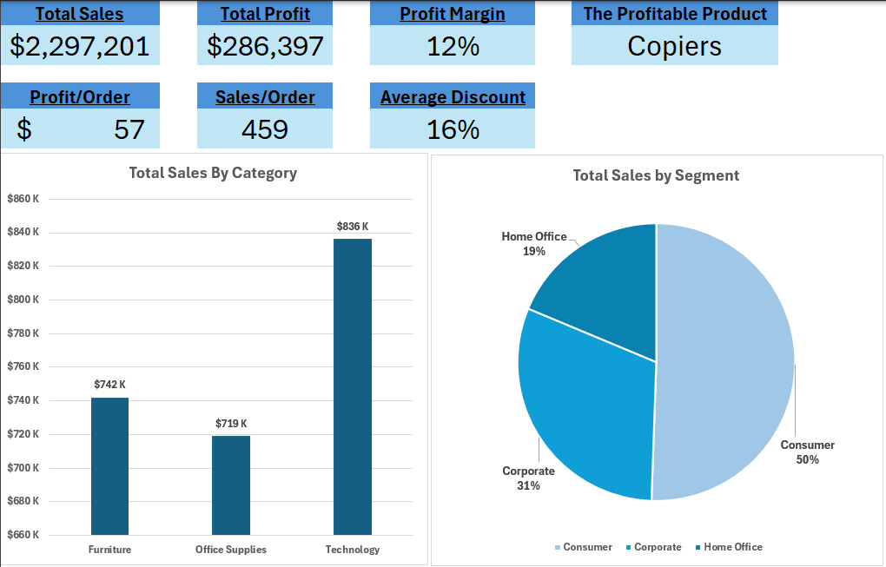

# Superstore Sales Analysis Dashboard (Excel)
This project was created as part of my data analytics learning journey using Excel.

## Project Overview
This project analyzes the Superstore dataset using Microsoft Excel to identify sales and profitability patterns across categories, segments, and time.
## Dashboard Preview

## Tools Used
- Microsoft Excel
- Power Query (ETL & data cleaning)
- Power Pivot (Data Modeling & DAX)
- PivotTables and PivotCharts
- Excel Dashboards & Slicers

## Key Features
- Interactive dashboard with KPI cards
- Sales and profit analysis by category and segment
- Discount impact analysis
- Correlation analysis between sales and profit
- Dynamic filtering using slicers

## Key Insights
- Technology category generated the highest sales and profit.
- Copiers are the most profitable sub-category.
- Higher discounts are associated with lower profitability.
- Sales and profit show a moderate positive correlation.

## Files
- `Superstore Dashboard.xlsx` – Final Excel dashboard
- `Superstore_Screenshots` – Dashboard visuals

## Author
Begad Ihab
